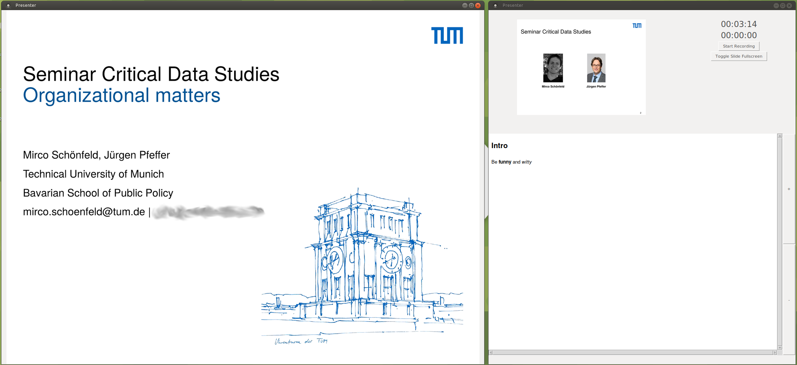

# Presenting and Recording
This is a collection of my scripts and tools I use to conduct and record my presentations. For more information, please refer to my website [here](http://mircoschoenfeld.de/emergency-remote-teaching.html), [here](http://mircoschoenfeld.de/a-presenter-view-for-linux.html), and [here](https://mircoschoenfeld.de/extract-notes-from-powerpoint-files.html) to learn more about the details.

## Presenterview 

Since I really love PowerPoint's presenter view, I decided to put together my own implementation of a presenter view that let's you present PDF files along with notes:


*A Tk-based tool to act like PowerPoint's presenter view*

To ease the process of extracting your slide notes from a Powerpoint file to show them using the `presenterview`, use the `extractnotes` script. A call to `extractnotes /path/to/presentation.pptx` produces the text file `/path/to/presentation.notes` containing your slide notes.

The tools that you find in this repo work together nicely such that, in the end, you have a `.mp4` video of your screen, your microphone audio annotated with chapter markers if you wish.

Again, please refer to [here](http://mircoschoenfeld.de/emergency-remote-teaching.html), [here](http://mircoschoenfeld.de/a-presenter-view-for-linux.html), and [here](https://mircoschoenfeld.de/extract-notes-from-powerpoint-files.html) to learn more about the details.

```
[DEFAULT]
RecordAnimatedSlides = no
RecordWebcam = no
RecordAdditionalRegion = no
RecordWriteWebVTT = yes
RecordWebcamDevice = /dev/video0
RecordAudioDevice = hw:0,1
RecordScreenCodec = libx264
RecordScreenCodecOptions = -preset ultrafast -qp 0 -pix_fmt yuv444p
RecordWebcamCodec = libx265
RecordWebcamCodecOptions = -preset fast -crf 26
RecordWebcamSize = 960x544
SlideGeom = 1920x1080
RecordProduceEverything = yes
RecordProduceCustomGeom = 1920x1080
PathToPPTX = /path/to/some/presentation_with_notes.pptx
RecordTitleImageGeom = 960x540
```

### Requirements

I recommend you install the following ubuntu/debian packages:

* ffmpeg
* libavcodec-extra
* gpac
* sox
* python3-tk
* python3-pil.imagetk
* xmlstarlet

And you should have these PIP packages:

* tkinterhtml
* pdf2image
* pillow
* markdown

## Other Tools
Among other things, you can find a little Python tool here that lets you select an area of the screen which you can then use for recording:


*The area under the large button is selected for recording upon clicking on it*

