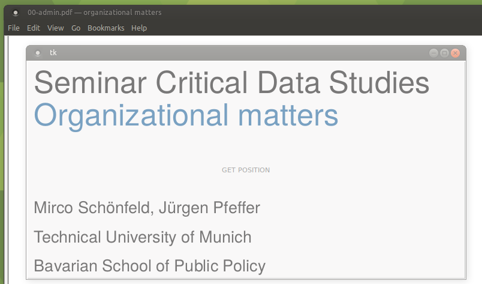
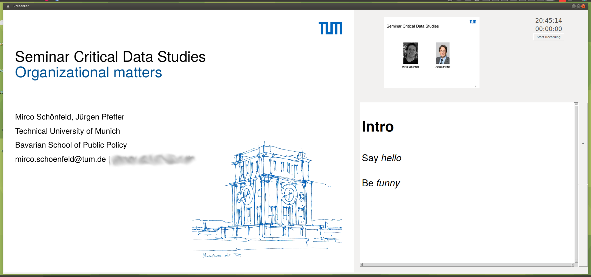

# Presenting and Recording
This is a collection of my scripts and tools I use to conduct and record my presentations. For more information, please refer to [my website](http://mircoschoenfeld.de/emergency-remote-teaching.html) to learn more about the details.

Among other things, you can find a little Python tool here that lets you select an area of the screen which you can then use for recording:

*The area under the large button is selected for recording upon clicking on it*

Also, since I really love PowerPoint's presenter view, I decided to put together my own implementation of a presenter view that let's you present PDF files along with notes:

*A Tk-based tool to act like PowerPoint's presenter view*

The tools that you find in this repo work together nicely such that, in the end, you have a `.mp4` video of your screen, your microphone audio annotated with chapter markers if you wish.

Again, please refer to [my website](http://mircoschoenfeld.de/emergency-remote-teaching.html) to learn more about the details.

## Requirements

I recommend you install the following ubuntu/debian packages:

* ffmpeg
* libavcodec-extra
* gpac
* sox
* python3-tk
* python3-pil.imagetk

And you should have these PIP packages:

* tkinterhtml
* pdf2image
* pillow

