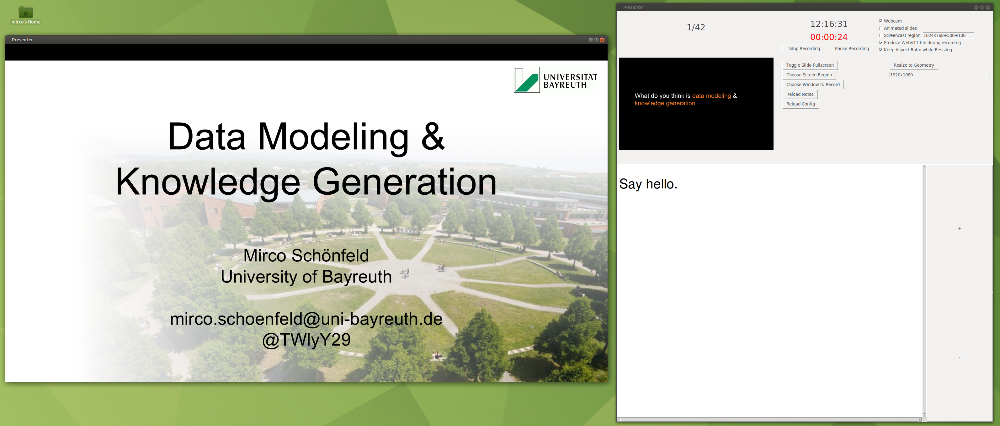
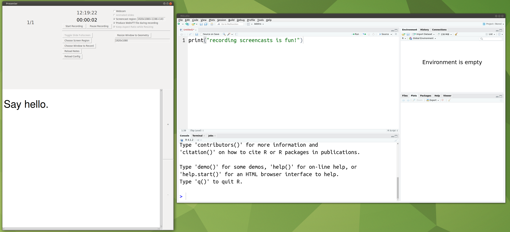

# Presenting and Recording
This is a collection of my scripts and tools I use to conduct and record my presentations. For more information, please refer to my website [here](https://mircoschoenfeld.de/a-presenter-view-for-linux-updated.html), [here](http://mircoschoenfeld.de/emergency-remote-teaching.html), and [here](https://mircoschoenfeld.de/extract-notes-from-powerpoint-files.html) to learn more about the details.

## Presenterview 

Since I really love PowerPoint's presenter view, but I'm mostly using Linux, I decided to put together my own implementation of a presenter view that let's you present PDF files along with notes:

*A Tk-based tool to act like PowerPoint's presenter view*

Please refer to [the documentation](https://mircoschoenfeld.de/a-presenter-view-for-linux-updated.html) to learn more about the details.

## Requirements

I recommend you install the following ubuntu/debian packages:

* ffmpeg
* libavcodec-extra
* python3-tk
* python3-pil.imagetk
* xmlstarlet
* x11-utils
* wmctrl

And you should have these PIP packages:

* tkinterhtml
* pdf2image
* pillow
* markdown
* plac

*The tool is also useful to record screencasts*
